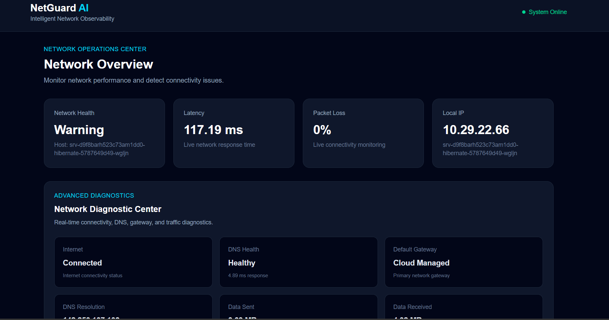
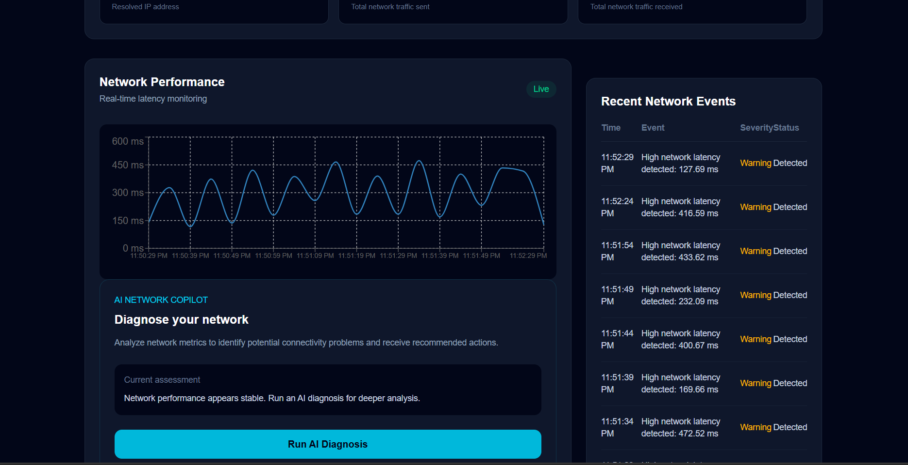
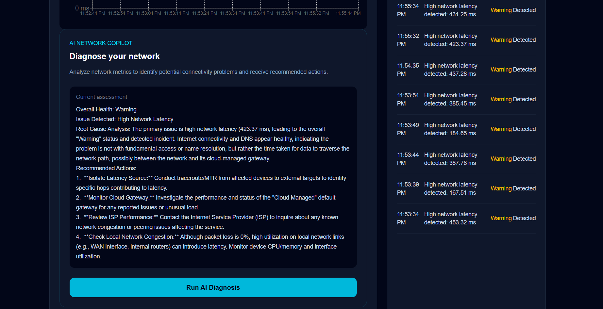
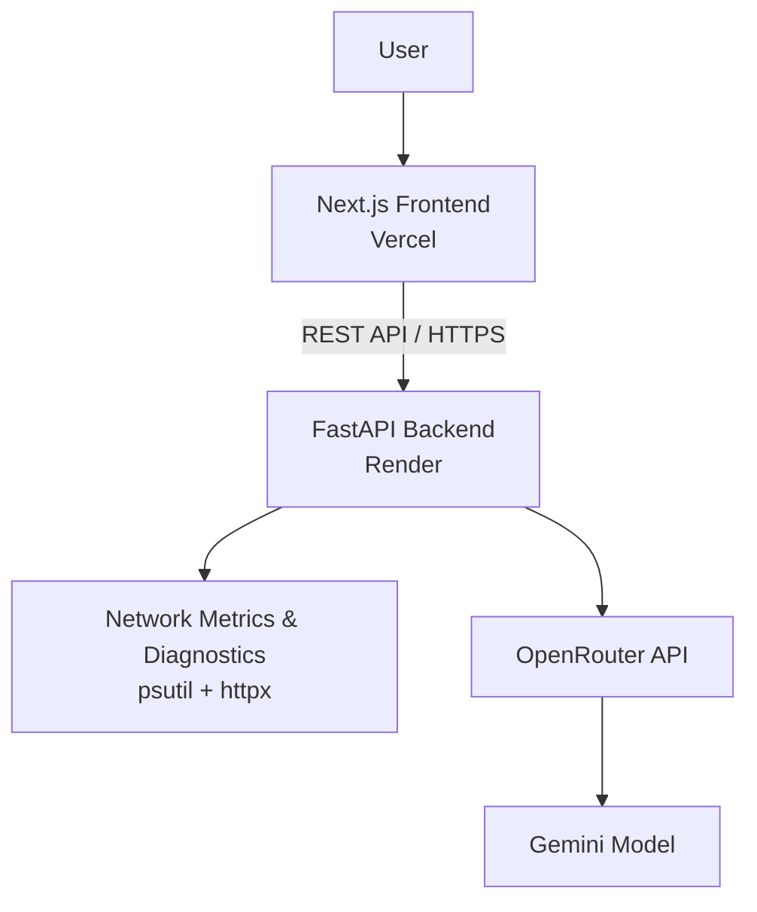

<div align="center">

#  NetGuard AI

### AI-Powered Real-Time Network Monitoring & Intelligent Diagnostics Platform

A full-stack observability platform that watches your network in real time, runs advanced diagnostics, and uses an LLM to explain *what's wrong and why* — turning raw metrics into plain-English root-cause analysis and troubleshooting steps.

[](https://netguard-ai-gamma.vercel.app/)
[](https://netguard-ai-2.onrender.com/)
[](#license)

[](#)
[](#)
[](#)
[](#)
[](#)

[Live Demo](https://netguard-ai-gamma.vercel.app/) · [API](https://netguard-ai-2.onrender.com/) · [Report Bug](https://github.com/Abhinav-fde/netguard-ai/issues) · [Request Feature](https://github.com/Abhinav-fde/netguard-ai/issues)

</div>


##  Dashboard Preview

<p align="center">
  
</p>

##  Network Performance

<p align="center">
  
</p>

##  AI Diagnosis

<p align="center">
  
</p>

##  Table of Contents

- [Overview](#-overview)
- [Why NetGuard AI](#-why-netguard-ai)
- [Features](#-features)
- [Architecture](#️-architecture)
- [Tech Stack](#️-tech-stack)
- [API Reference](#-api-reference)
- [AI Diagnosis Workflow](#-ai-diagnosis-workflow)
- [Getting Started](#-getting-started)
- [Environment Variables](#-environment-variables)
- [Project Structure](#-project-structure)
- [Roadmap](#-roadmap)
- [Author](#-author)

---

##  Overview

**NetGuard AI** is a production-deployed, full-stack network observability tool. It continuously samples system and network-level metrics (latency, packet loss, DNS health, connectivity, traffic), surfaces them through a live dashboard, and feeds the data to an LLM (via OpenRouter/Gemini) that acts as an on-call network engineer — diagnosing issues and recommending fixes in real time.

It's built the way a real monitoring product would be: separate frontend/backend services, a documented REST API, environment-based configuration, and independent deployments on Vercel and Render.

##  Why NetGuard AI

Most student projects stop at "displays some data on a dashboard." NetGuard AI goes further by combining three things that are genuinely hard to get right together:

- **Systems programming** — pulling real OS/network-level metrics (`psutil`, sockets, DNS resolution) rather than mock data
- **Full-stack engineering** — a typed Next.js/TypeScript frontend talking to an async FastAPI backend over a clean REST contract
- **Applied AI** — using an LLM not as a chatbot bolted on top, but as a reasoning layer over live telemetry to produce root-cause analysis

##  Features

###  Real-Time Network Monitoring
- Live network latency tracking with continuous sampling
- Network health status detection (healthy / degraded / critical)
- Packet-loss monitoring
- Local IP and hostname resolution
- Real-time performance visualization via interactive charts

###  Advanced Network Diagnostics
- Internet connectivity detection
- DNS health monitoring and resolution testing
- DNS response-time measurement
- Default gateway detection
- Live network traffic monitoring (bytes sent/received)

###  AI Network Copilot
An AI-powered diagnostic assistant that reads current network metrics and returns:
- Overall network health assessment
- Automatic issue detection
- Root-cause analysis in plain English
- Actionable troubleshooting recommendations
- Performance-improvement suggestions

Powered through the **OpenRouter API** using **Google Gemini**.

###  Network Event Detection
Automatically detects and logs events such as:
- High-latency spikes
- Internet connectivity drops
- Network health warnings
- Critical network conditions

###  Live Performance Visualization
Latency history is rendered as a continuously updating chart (Recharts), giving an at-a-glance view of network trends over time.

---

##  Architecture
## Architecture


**Design notes:**
- Frontend and backend are independently deployed and scaled (Vercel + Render), mirroring a real microservice split.
- The backend exposes a stable REST contract, so the AI provider (OpenRouter/Gemini) can be swapped without touching the frontend.
- All secrets are environment-scoped and never committed to source control.

## 🛠️ Tech Stack

| Layer | Technologies |
|---|---|
| **Frontend** | Next.js, React, TypeScript, Recharts, CSS |
| **Backend** | Python, FastAPI, Uvicorn, HTTPX, psutil |
| **AI Integration** | OpenRouter API, Google Gemini |
| **Deployment** | Vercel (frontend), Render (backend) |
| **Tooling** | Git, GitHub, VS Code |

---

## 📡 API Reference

Base URL (production): `https://netguard-ai-2.onrender.com`

| Endpoint | Method | Description |
|---|---|---|
| `/` | `GET` | Backend service health check |
| `/api/network-health` | `GET` | Returns current network health metrics |
| `/api/diagnostics` | `GET` | Runs advanced network diagnostics |
| `/api/diagnose` | `POST` | Generates an AI-powered network diagnosis from current metrics |

**Metrics tracked:** latency · packet loss · internet connectivity · DNS health · DNS response time · DNS resolution · network traffic · local IP · hostname · gateway info

## 🤖 AI Diagnosis Workflow

```text
Network Metrics
      │
      ▼
FastAPI Backend  ──►  Diagnostic Data Collection
      │
      ▼
   OpenRouter API  ──►  Gemini Model
      │
      ▼
AI Root-Cause Analysis + Troubleshooting Recommendations
      │
      ▼
   Next.js Dashboard
```

---

## ⚙️ Getting Started

### Prerequisites
- Node.js 18+
- Python 3.10+
- An [OpenRouter](https://openrouter.ai/) API key

### 1. Clone the repository

```bash
git clone https://github.com/Abhinav-fde/netguard-ai.git
cd netguard-ai
```

### 2. Backend setup

```bash
cd backend
python -m venv venv

# Activate the virtual environment
# Windows:
venv\Scripts\activate
# macOS/Linux:
source venv/bin/activate

pip install -r requirements.txt
```

Create a `.env` file inside `backend/`:

```env
OPENROUTER_API_KEY=your_openrouter_api_key
```

Run the backend:

```bash
uvicorn main:app --reload
```

The API will be available at `http://127.0.0.1:8000`.

### 3. Frontend setup

In a new terminal:

```bash
cd frontend
npm install
```

Create a `.env.local` file inside `frontend/`:

```env
NEXT_PUBLIC_API_URL=http://127.0.0.1:8000
```

Start the dev server:

```bash
npm run dev
```

Open [http://localhost:3000](http://localhost:3000) in your browser.

---

## 🔐 Environment Variables

| Variable | Location | Description |
|---|---|---|
| `OPENROUTER_API_KEY` | `backend/.env` | API key for AI-powered diagnosis via OpenRouter/Gemini |
| `NEXT_PUBLIC_API_URL` | `frontend/.env.local` | URL of the FastAPI backend the frontend talks to |

> ⚠️ Never commit API keys or `.env` files to version control.

## 📂 Project Structure

```text
netguard-ai/
│
├── backend/
│   ├── main.py            # FastAPI app & routes
│   ├── requirements.txt
│   └── .env                # (gitignored)
│
├── frontend/
│   ├── app/
│   │   ├── page.tsx        # Dashboard UI
│   │   ├── layout.tsx
│   │   └── globals.css
│   ├── public/
│   ├── package.json
│   └── .env.local          # (gitignored)
│
└── README.md
```

---

## 🔮 Roadmap

- [ ] Historical network performance storage
- [ ] User authentication
- [ ] Persistent database integration
- [ ] Email / push notification alerts
- [ ] Multi-device monitoring
- [ ] ML-based network anomaly detection
- [ ] Automated incident reports
- [ ] Network uptime statistics
- [ ] WebSocket-based live updates
- [ ] Cloud monitoring integrations (AWS/GCP/Azure)

## 👨‍💻 Author

**Abhinav**
Computer Science & Engineering student — building at the intersection of AI, full-stack development, and cloud infrastructure.

[](https://github.com/Abhinav-fde)

<!-- Add LinkedIn, portfolio, or email badges here for extra visibility, e.g.:
[](https://linkedin.com/in/your-handle)
[](https://your-portfolio.com)
-->

---

<div align="center">

### ⭐ If you find this project useful, consider giving it a star!

</div>
